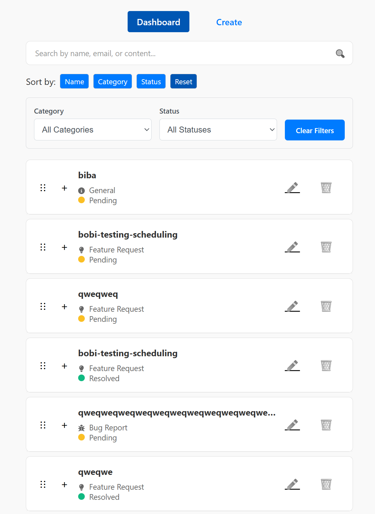
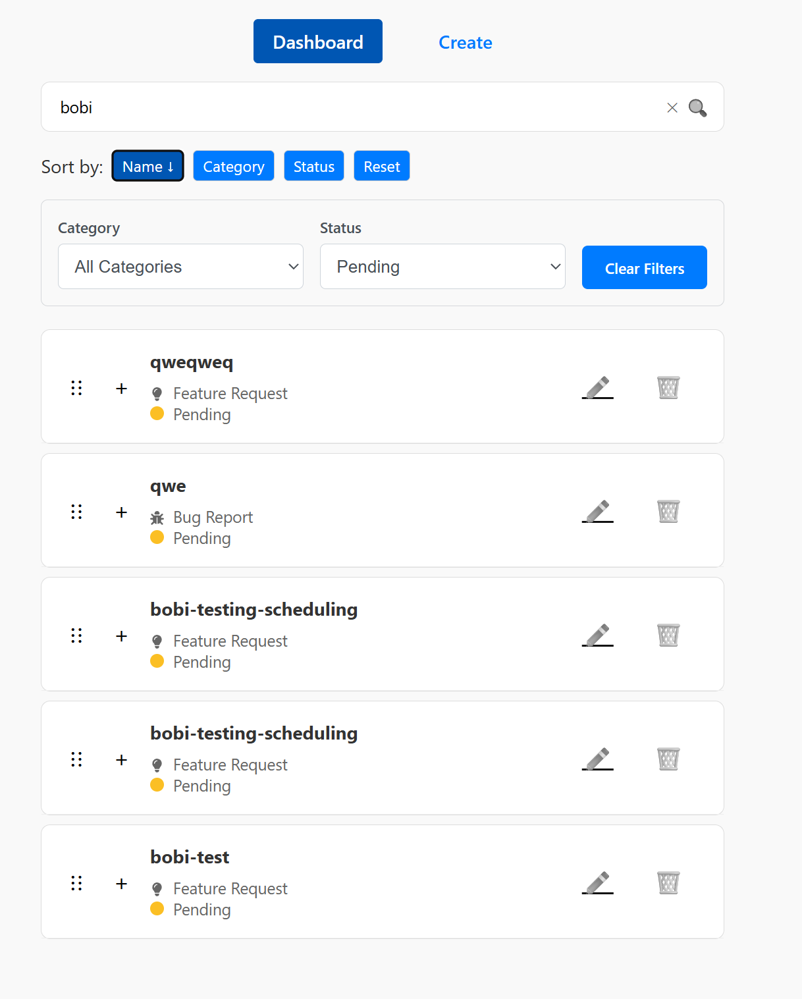
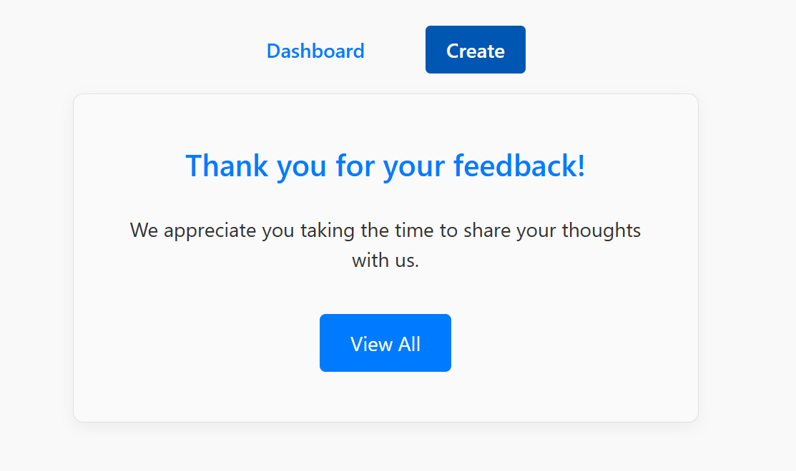
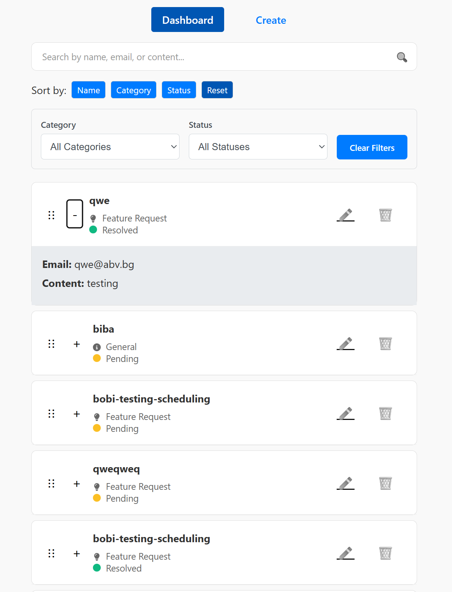

## Dynamic Dashboard

Installation steps:
1. Ensure you have node.js latest version installed
2. Clone the repo https://github.com/kachamachkov/dashboard
3. cd dashboard
4. cd server
5. npm i
6. npm run start:prod
7. open new terminal
8. cd client
9. npm i
10. npm run start:prod

For Development Enviroment (on both client/server):
- npm run dev
- Local production enviroment is served on: http://localhost:4173/
- Local development enviroment is served on http://localhost:5173/

